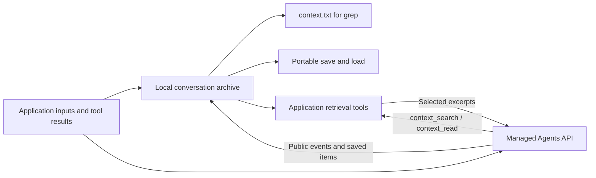

# Searchable conversation context

**OpenAI manages the agent's working memory. We keep our own conversation archive.** When an older detail is needed, the agent searches the archive and reads a small excerpt. No compaction signal is required.

This implements [decision D002](../DECISIONS.md#d002-keep-a-searchable-conversation-archive-outside-the-managed-harness). It is a reusable TypeScript component, with an optional connection to tracer's turn collector. The existing research runners do not silently start archiving or dispatch new paid work.



## What gets saved

| Record | When it is saved |
| --- | --- |
| Outgoing input, including configuration supplied by the caller | Before the API request; labeled as intent, not proof of server acceptance |
| Application tool results | Before transmission; identical retries return the saved result |
| Stream events | As received, with event IDs for deduplication |
| Public messages and tool items | From the stream and paginated history retrieval |
| Child-agent items | From each child's separate history, with its scope preserved |
| Collection gaps and unfinished output | Explicitly labeled; they are not presented as complete history |

The archive retains earlier revisions. If an item later becomes shorter, its earlier captured text stays searchable. Receiving a shorter item list never deletes older records. An application's conversation ID can span multiple explicitly bound sessions; a single `AgentsContext` adapter binds to only one session.

Record completion describes capture, not task success or factual correctness. Failed and incomplete messages retain their status labels; they are still historical records.

OpenAI documents that live streams do not replay missed events and that child agents have separate histories. Saved-item reconciliation can recover available items after a disconnect; it cannot reconstruct every missed delta. Use the stream plus paginated root and child history retrieval. [Agents events and recovery documentation](https://developers.openai.com/api/docs/guides/agents-api/sessions/events).

This captures **data exposed to our application**, not OpenAI's hidden working prompt. It does not recover content lost before capture, download image/file attachments, or expose private reasoning. Attachment references and exposed reasoning summaries are retained as provided. Retrieved history is not a snapshot of what the model currently sees. [Agents observability documentation](https://developers.openai.com/api/docs/guides/agents-api/observability).

## Files and interface

Each archive directory contains:

- `manifest.json`: format version and application conversation ID.
- `journal.jsonl`: authoritative append-only records, flushed after each append. Each line is independently readable JSON with a sequence, revision, timestamp and chained hash.
- `context.txt`: a derived UTF-8 transcript for `rg` or an editor. Rebuilt at turn completion or an explicit checkpoint. Earlier completed revisions remain visible; unfinished text is labeled `PROVISIONAL`.
- `.writer.lock`: present while a writer owns the archive.

`ContextManager` defines `record`, `search`, `read`, `checkpoint`, `save` and `close`. `FileContext` implements it without importing the OpenAI SDK or using the network. `FileContext.create`, `open` and `load` select or restore storage. `AgentsContext` is the separate adapter for the pinned official SDK.

```ts
import {FileContext, AgentsContext} from './src/context/index.js';

const store = FileContext.create('.tracer/context/conversation-1');
const archive = new AgentsContext(store);

// Do this before sending a request. Keep the request ID stable on a retry.
archive.input('request-1', {input: 'Remember the shipping reference: coral-742'});

// Once the application receives the session ID:
archive.bindSession(sessionId);

// In the existing stream consumer:
archive.capture(event);

// Before sending a local tool result:
archive.toolResult(turnId, callId, output);

// At a turn boundary or after reconnecting:
await archive.reconcile(client); // Read-only, paginated API requests; no inference.
archive.checkpoint();
store.save('.tracer/context/conversation-1.json');
store.close(); // Use finally in the surrounding application.

// Later, including in a different process:
const restored = FileContext.load(
  '.tracer/context/conversation-1.json',
  '.tracer/context/conversation-1-restored',
);
const hits = restored.search({query: 'shipping reference:'});
const excerpt = restored.read(hits.matches[0]!.sequence);
restored.close();
```

These are integration points inside a caller-owned session lifecycle; `sessionId`, `event`, `client` and tool values come from that application. `reconcile()` defaults to 50 history pages and 16 child agents, with request timeouts and no SDK retries. Reaching a limit records incomplete coverage and throws. Pages already captured remain saved. Enumeration is not atomic while the session is changing.

The adapter does not open streams or reconnect automatically. On reconnect, consume/buffer the new stream while retrieving saved items, then apply buffered events; deduplication and final-item precedence handle repeated events and late partial text. Stable IDs are preferred. Items with null IDs use content plus list position; reordered legacy items can appear as duplicates.

## Give the model access

Add `CONTEXT_TOOLS` to the managed agent's tool configuration and `CONTEXT_INSTRUCTIONS` to its persistent instructions. Bind `contextTools(store, sessionId)` in application code. Dispatch only current required actions to its handler, then send the returned string through the ordinary tool-result endpoint.

```ts
import {CONTEXT_TOOLS, CONTEXT_INSTRUCTIONS, contextTools} from './src/context/index.js';

// Merge these into the configuration used to create/update the managed agent:
const archiveConfiguration = {
  tools: CONTEXT_TOOLS,
  instructions: CONTEXT_INSTRUCTIONS,
};

// Bind after the application establishes the session ID:
const retrieval = contextTools(store, sessionId);
const output = retrieval.handle(sessionId, requiredFunctionAction);
archive.toolResult(requiredFunctionAction.turn_id, requiredFunctionAction.call_id, output);
// Send output using the application's normal tool-result transport.
```

`context_search` uses literal, case-sensitive text, with up to 20 small excerpts and a pagination cursor. It searches captured conversation records and prior completed revisions by default. `context_read` fetches a record in chunks of at most 6,000 characters. Tool replies cannot exceed 24 KB; larger requests fail with a request to use a smaller page. Search excludes provisional records by default; a host can include them explicitly through the TypeScript interface.

The model cannot choose a filesystem path or another archive. The host binds the conversation and authorizes which sessions may access it. Historical content is labeled as data, not new instructions or tool authorization. Retrieval results are persisted by call ID, so a retry after restart returns the same bytes even if the archive has grown. This archive is not an authorization system for business tools.

For tracer's existing `collectTrial`, pass `context: archive` in `CollectionOptions`. The collector saves inputs before dispatch, captures events and history pages, saves tool outputs before sending, and checkpoints in cleanup. The caller owns `store.close()`. Add the retrieval tools to the request and dispatch them through `contextTools` alongside the application's other tools. The collector's existing cancellation and spending guards still apply; enabling the archive adds no inference calls.

## Offline commands

```sh
pnpm context init .tracer/context/example
pnpm context append .tracer/context/example entry.json
pnpm context search .tracer/context/example "shipping reference"
pnpm context read .tracer/context/example 0
pnpm context save .tracer/context/example .tracer/context/example.json
pnpm context load .tracer/context/example.json .tracer/context/restored
rg -n -F "shipping reference" .tracer/context/restored/context.txt
```

`entry.json` is an application-authored record:

```json
{"key":"note-1","kind":"note","sessionId":null,"turnId":null,"scope":"application","text":"shipping reference: coral-742","data":{"reference":"coral-742"},"complete":true}
```

Creation, loading and snapshot export refuse to overwrite existing destinations. Ordinary resume uses `FileContext.open(existingDirectory)`; `load` imports a saved snapshot into a new directory. The CLI also supports `status` and `import-log`. All these commands are offline and need no key.

## Storage behavior and limits

The current implementation supports one writer per archive, 2 MiB per journal record and 256 MiB per journal. It loads the journal into memory. Exceeding a cap or failing to write throws; records are never silently evicted. Raw stream deltas are appended immediately; the text projection updates at checkpoints instead of rewriting the full transcript for each token.

Snapshots include the full journal with integrity checks. Copy snapshots to independent storage for backup. Chained hashes help detect changed records; without an independently retained head they cannot prove that whole final records were not removed or that an attacker did not rewrite the chain. These files are plaintext. `.tracer/` is git-ignored; filesystem access controls and backup policy belong to the deploying application. Do not put API keys or authorization headers into archived inputs.

If a process crashes, its writer lock is left in place. Verify that the recorded PID no longer owns a running writer before removing that lock. A partial final journal line causes normal open to fail. After resolving the lock, `FileContext.open(path, {recoverTail: true})` preserves the partial bytes in a separate file and repairs only that unfinished tail. Committed-record corruption remains an error. A live read racing an incomplete append may also need to retry after the writer finishes.

## What we verified

The tests cover persistence, save/load, literal search, revisions, corruption, interrupted output, duplicate events, paginated root/child retrieval, partial collection, bounded tools and collector write ordering. A synthetic working-history reduction checks that archive retrieval does not depend on text remaining in the prompt.

We also replayed an existing real Agents transcript through the adapter, saved and loaded its archive, and recovered an older user message exactly through the same search/read handlers. An empty-archive control returned no matches. The [verification receipt](../evidence/context-archive/verification.json) records source and recovered hashes, counts and limitations.

Reproduce that check without API calls:

```sh
pnpm context-demo evidence/runs/2026-09-11T14-53-15-103Z-context-observation-v10-last-11441bae/b1-control/11-recovery/events.jsonl .tracer/context/demo-new
```

This validates the archive and retrieval path locally. It does **not** establish that a live model reliably chooses the retrieval tools, or that recovery has crossed an observed managed-compaction boundary. The [original research result](../research/23-managed-observation-results.md) remains inconclusive on that boundary. The architecture makes compaction detection unnecessary for keeping and offering captured conversation records.
